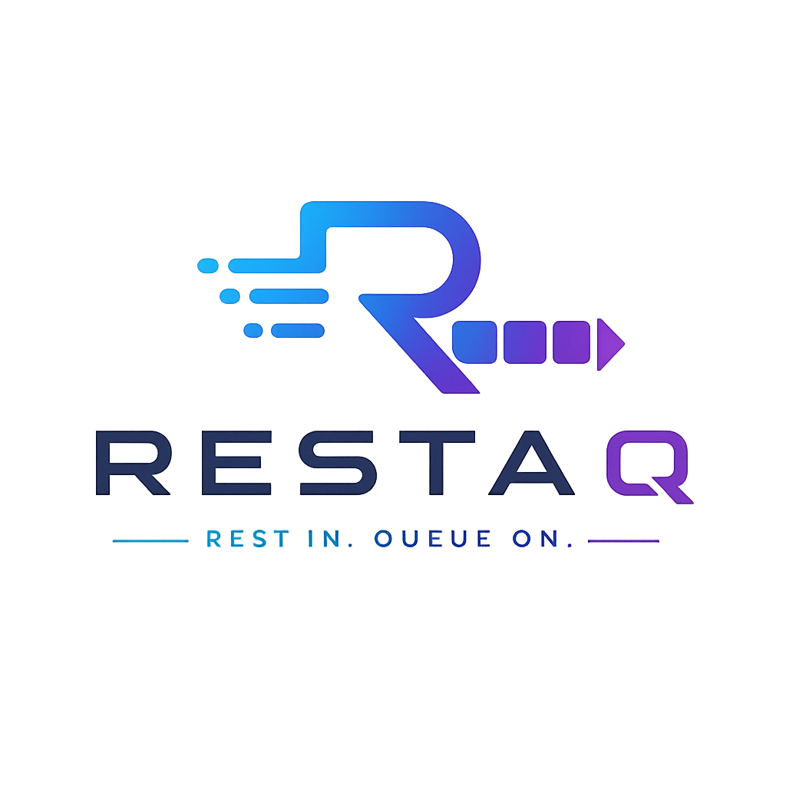

<p align="center">
  
</p>

# RESTAQ

> REST in. Queue on.

**RESTAQ** is a lightweight, Spring Boot–based messaging gateway designed for crossing network boundaries using asynchronous messaging.

It exposes configurable REST POST endpoints that forward incoming requests into messaging infrastructures such as **AMQP** (RabbitMQ) and **JMS** (ActiveMQ Artemis), while also supporting the reverse direction through proactive HTTP callback delivery.

---

## Features

- REST → Queue gateway (sender)
- Queue → REST consumer delivery (receiver)
- Optional synchronous request-reply mode over queues
- Supports AMQP and JMS
- Configurable retry with backoff and dead-letter queue support
- Message time-to-live enforcement
- RFC 9457 Problem Details error responses
- Transparent HTTP header propagation (with TLS/transport filtering)
- Configurable payload size limits
- Stateless and horizontally scalable
- DMZ / integration-zone friendly architecture

---

## How It Works

```
Client ──POST──▶ RESTAQ Sender ──▶ Queue ──▶ RESTAQ Receiver ──POST──▶ Target
```

**Sender:** Accepts HTTP POST requests, filters headers, validates payload size, and places the message on a queue. Returns `202 Accepted` on success or `502 Bad Gateway` with Problem Details on failure.

**Receiver:** Consumes messages from a queue and delivers them via HTTP POST to a configured target URL. Retries with backoff on failure, injects `X-Retry-Count` header, and routes to the broker's DLQ after exhausting retries.

---

## Quick Start

### Prerequisites

- JDK 25
- Docker (for integration tests)
- A message broker (RabbitMQ or ActiveMQ Artemis)

### Build

```bash
./gradlew build
```

### Run

```bash
./gradlew bootRun
```

### Minimal Configuration

```yaml
restqa:
  type: amqp
  sender:
    orders:
      rest:
        path: /api/orders
      queue:
        name: orders.queue
      synchronous:
        receiver-ref: order-processor
      timeout: 30s
  receiver:
    order-processor:
      queue:
        name: orders.queue
      timeout: 30s
    notifications:
      rest:
        url: http://downstream:8080/notify
      queue:
        name: notifications.queue
      retry:
        max-retries: 5
        backoff-period: 10s
      timeout: 30s
```

---

## Configuration Reference

| Property | Description | Default |
|----------|-------------|---------|
| `restqa.type` | Queue technology: `amqp` or `jms` | `amqp` |
| `restqa.max-payload-size` | Maximum request body size (e.g. `10MB`) | *(none)* |
| `restqa.sender.<name>.rest.path` | REST endpoint path | — |
| `restqa.sender.<name>.queue.name` | Queue/destination name | — |
| `restqa.sender.<name>.queue.exchange` | AMQP exchange (optional) | — |
| `restqa.sender.<name>.queue.routingKey` | AMQP routing key (optional) | queue name |
| `restqa.sender.<name>.synchronous.receiver-ref` | Receiver name for synchronous mode | — |
| `restqa.sender.<name>.timeout` | Max wait time for synchronous response | `30s` |
| `restqa.receiver.<name>.rest.url` | Target callback URL (omit for sync-only receivers) | — |
| `restqa.receiver.<name>.queue.name` | Queue/destination name | — |
| `restqa.receiver.<name>.retry.max-retries` | Max delivery attempts (async only) | `3` |
| `restqa.receiver.<name>.retry.backoff-period` | Delay between retries (async only) | `5s` |
| `restqa.receiver.<name>.time-to-live` | Max message age | *(none)* |
| `restqa.receiver.<name>.timeout` | Max processing/wait time | `30s` |

Broker connectivity uses Spring Boot standard properties (`spring.rabbitmq.*` / `spring.artemis.*`).

---

## Technology Stack

| Component | Technology |
|-----------|-----------|
| Language | Kotlin |
| Framework | Spring Boot 4 |
| Web Layer | Spring WebFlux |
| Messaging | Spring AMQP, Spring JMS |
| Error Handling | Arrow (`Either`), Spring ProblemDetail |
| Build | Gradle (Kotlin DSL), JDK 25 |
| Testing | JUnit 5, Mockito-Kotlin, Testcontainers, WireMock |

---

## Documentation

Full documentation is available via MkDocs in the [`docs/`](docs/) directory:

```bash
cd docs
pip install mkdocs-material
mkdocs serve
```

---

## CI/CD

The project uses GitHub Actions with two pipelines:

**CI** (`ci.yml`) — triggered on push to `main` and pull requests:

- **Build** — compile and run the full test suite
- **Licence** — validate dependency licences, generate licence report
- **Documentation** — build MkDocs in strict mode to verify integrity

**Release** (`release.yml`) — triggered on any tag push:

- **Pre-Check** — verifies that `CHANGELOG.md` contains a matching `# [<tag>]` entry
- **Build** — compile and test
- **Licence** — licence check and report
- **Documentation** — build and deploy versioned docs to GitHub Pages via mike
- **Release** — create a GitHub Release with changelog notes; tags starting with `0.` or a letter are marked as pre-release

---

## License

See [LICENSE](LICENSE) for details.
